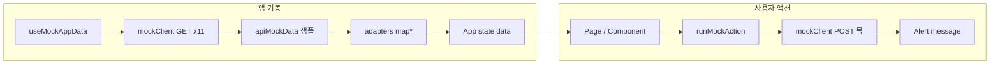

# 데이터 흐름

## 1. 초기 로드 (`useMockAppData`)

[`src/hooks/useMockAppData.ts`](../../src/hooks/useMockAppData.ts)가 마운트 시 다음을 **병렬** 호출합니다.

- `getDashboard`, `getCompanyProfile`, `getCompanyChoices`, `getJobDescriptions`
- `getCoverLetterDraft`, `getCoverLetters`, `getAnalysisReport`, `getRecruitmentPreview`
- `getCoverLetterTemplate`, `getUserProfile`, `getNotifications`, `getAuthDefaults`

각 응답의 `data`는 [`adapters.ts`](../../src/api/adapters.ts)로 UI 모델로 변환 후 `App`에 전달됩니다.

## 2. 사용자 액션 (`runMockAction`)

[`src/App.tsx`](../../src/App.tsx)의 `runMockAction`이 로딩 키를 잡고 `mockClient.*`를 호출합니다. 성공 시 `response.message`를 Alert로 표시합니다.

Django 연동 시: 동일 흐름으로 HTTP 클라이언트 + `status_code` / `message` 파싱.

## 3. 페이지 로컬 상태

`App.tsx`에서만 관리하는 예:

| 상태 | 용도 |
|------|------|
| `selectedJdIdOverride` | JD·자소서·템플릿에서 선택 JD |
| `selectedRowKeys` | 모집 공고 다중 JD 선택 |
| `chatMessages` | 채팅 메시지 누적 |
| `coverUploaded`, `analysisDone` | 자소서 업로드·분석 UI 플래그 |
| `postGenerated`, `templateGenerated` | 생성 결과 표시 여부 |

이 값들은 **아직 API에 반영되지 않습니다.** 백엔드 연동 시 서버 상태와 동기화가 필요합니다.

## 관련 문서

- [API 공통 래퍼](./api-envelope.md)
- [API 레퍼런스](../06-api/api-reference.md)
