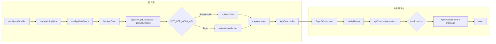

# 데이터 흐름



## 1. 초기 로드

[`src/main.tsx`](../../src/main.tsx)가 `AppQueryProvider`로 앱을 감쌉니다.

[`src/hooks/useMockAppData.ts`](../../src/hooks/useMockAppData.ts) → [`useAppDataQuery`](../../src/hooks/useAppDataQuery.ts) → [`loadAppData`](../../src/api/appDataService.ts):

- `apiClient.getDashboard()`
- `apiClient.getAuthDefaults()`

기본 mock 모드에서는 [`src/data/apiMockData.ts`](../../src/data/apiMockData.ts)의 로컬 샘플을 사용합니다. `VITE_USE_MOCK_API=false`에서는 [`src/api/backendClient.ts`](../../src/api/backendClient.ts)가 axios로 다음 endpoint 조합을 호출합니다.

- `account/get`
- `compinfo/get`
- `jd/get`
- `resume/get`
- `report/get`
- `question/get`

응답은 [`src/api/adapters.ts`](../../src/api/adapters.ts)에서 UI 모델로 변환된 뒤 React Query 캐시에 저장되고, `App.tsx`는 `useMockAppData` 결과를 props로 페이지에 전달합니다.

로그인 성공 등 데이터 갱신이 필요할 때 `reload()` → `refetch()`로 같은 경로를 다시 실행합니다.

## 2. 사용자 액션

[`src/App.tsx`](../../src/App.tsx)의 `runApiAction`은 로딩 키를 설정하고 `apiClient` action method를 호출합니다.

- 성공: `response.error === false`이면 `response.message`를 success Alert로 표시
- 실패: axios error 또는 `response.error === true`이면 error Alert 표시

예:

- 로그인 성공 → `reload()` → `/dashboard`
- 회원가입 ID 중복 확인 → `apiClient.checkSignupId(username)`
- 비밀번호 재설정 → `getPasswordQuestion` → `resetPassword`
- 회사 정보 저장 → `apiClient.saveCompanyProfile`
- JD 분석 요청 → `apiClient.requestJobAnalysis`
- 채팅 전송 → `apiClient.sendChatMessage(question, messages)`

mock 모드에서는 네트워크 없이 성공 응답을 반환합니다. real API 모드에서는 axios 요청이 실행됩니다.

## 3. axios client

`backendClient.ts`의 axios client:

```ts
axios.create({
  baseURL: '/api',
  withCredentials: true,
  headers: {
    'Content-Type': 'application/json',
  },
});
```

request interceptor:

1. `VITE_API_KEY`가 있으면 `X-API-Key` 헤더 추가
2. POST 요청이면 `csrftoken` 쿠키 확인, 없으면 `GET /api/csrf/` 호출
3. `X-CSRFToken` 헤더 추가

## 4. 로컬 UI 상태

`App.tsx`에서만 관리하는 상태:

| 상태 | 용도 |
|------|------|
| `selectedJdIdOverride` | JD/자소서/템플릿 화면에서 선택된 JD |
| `selectedRowKeys` | 모집 공고 화면의 다중 JD 선택 |
| `chatMessages`, `chatInput` | `DocumentChatFab`와 `ChatPage` 공유 채팅 상태 |
| `coverUploaded`, `analysisDone` | 자기소개서 업로드/분석 UI 플래그 |
| `postGenerated`, `templateGenerated` | 생성 결과 표시 여부 |
| `resetStep` | 비밀번호 재설정 단계 (0: ID, 1: 질문, 2: 임시 비밀번호) |

서버 저장이 필요한 기능 중 아직 mock 응답만 반환하는 항목은 [api-spec-addendum.md](../06-api/api-spec-addendum.md)를 참고하세요.

## 관련 문서

- [API 공통 응답 형식](./api-envelope.md)
- [API 레퍼런스](../06-api/api-reference.md)
