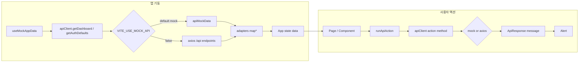

# 데이터 흐름



## 1. 초기 로드

[`src/hooks/useMockAppData.ts`](../../src/hooks/useMockAppData.ts)는 mount 후 다음을 호출합니다.

- `apiClient.getDashboard()`
- `apiClient.getAuthDefaults()`

기본 mock 모드에서는 [`src/data/apiMockData.ts`](../../src/data/apiMockData.ts)의 로컬 샘플을 사용합니다. `VITE_USE_MOCK_API=false`에서는 [`src/api/backendClient.ts`](../../src/api/backendClient.ts)가 axios로 다음 backend endpoint 조합을 호출합니다.

- `account/get`
- `compinfo/get`
- `jd/get`
- `resume/get`
- `report/get`
- `question/get`

응답 데이터는 [`src/api/adapters.ts`](../../src/api/adapters.ts)에서 UI 모델로 변환된 뒤 `App` 상태로 전달됩니다.

## 2. 사용자 액션

[`src/App.tsx`](../../src/App.tsx)의 `runApiAction`은 로딩 키를 설정하고 `apiClient` action method를 호출합니다. 성공하면 `ApiResponse.message`를 Alert로 표시하고, 실패하면 `Error.message`를 Alert로 표시합니다.

예:

- 로그인 성공 → `reload()` → `/dashboard`
- 회사 정보 저장 → `apiClient.saveCompanyProfile`
- JD 분석 요청 → `apiClient.requestJobAnalysis`
- 자기소개서 분석 요청 → `apiClient.requestCoverLetterAnalysis`

mock 모드에서는 위 액션들이 네트워크 없이 성공 응답을 반환합니다. real API 모드에서는 axios 요청이 실행됩니다.

## 3. axios client

`backendClient.ts`의 axios client는 다음 공통 설정을 사용합니다.

```ts
axios.create({
  baseURL: '/api',
  withCredentials: true,
  headers: {
    'Content-Type': 'application/json',
  },
});
```

POST 요청 전 request interceptor에서 `csrftoken` 쿠키를 확인하고, 없으면 `/api/csrf/`를 호출한 뒤 `X-CSRFToken` 헤더를 추가합니다.

## 4. 로컬 UI 상태

`App.tsx`에서만 관리하는 상태:

| 상태 | 용도 |
|------|------|
| `selectedJdIdOverride` | JD/자소서/템플릿 화면에서 선택된 JD |
| `selectedRowKeys` | 모집 공고 화면의 다중 JD 선택 |
| `chatMessages`, `chatInput` | `DocumentChatFab`와 `ChatPage` 공유 채팅 상태 |
| `coverUploaded`, `analysisDone` | 자기소개서 업로드/분석 UI 플래그 |
| `postGenerated`, `templateGenerated` | 생성 결과 표시 여부 |

이 값들은 현재 mock UI 상태입니다. 서버 저장이 필요한 기능은 추가 endpoint 명세가 필요합니다.

## 관련 문서

- [API 공통 응답 형식](./api-envelope.md)
- [API 레퍼런스](../06-api/api-reference.md)
